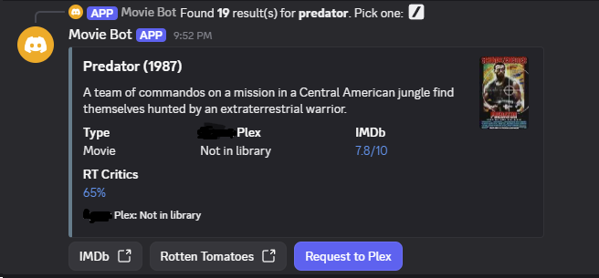
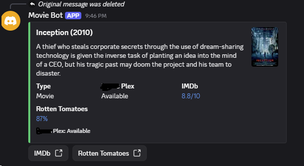

# Seerr Discord Bot

Search movies and TV shows from Discord, preview IMDb / Rotten Tomatoes critic scores via OMDb, and send requests to your [Seerr](https://seerr.dev/) (or Overseerr-compatible) instance. This is a very basic and simple discord bot with no arr's integration. The point of this bot was to just view movies/shows in discord and be able to send a request to seerr quickly. If your arrs/program is setup to handle seerr requests properly it works great. This should also work for jellyfin. For example I use Seerr -> Cli_Debird -> Plex






## Features

- `!search <name>` and `/search` hybrid commands
- Result picker → rich embed with poster, plot, IMDb + RT Critics
- Request button (optional custom emoji) — hidden when already available
- TV shows: choose all seasons or a specific season before requesting
- Public confirmation when a request is submitted

## Requirements

- Python 3.11+
- A Discord bot application
- A running Seerr / Overseerr instance and API key
- A free [OMDb API key](http://www.omdbapi.com/apikey.aspx)

## Setup

### 1. Create the Discord bot

1. Go to the [Discord Developer Portal](https://discord.com/developers/applications) → **New Application**.
2. Open **Bot** → **Add Bot** → copy the token.
3. Enable **Message Content Intent** (required for `!search`).
4. Invite the bot with scopes `bot` and `applications.commands`, and permissions to Send Messages, Embed Links, Use External Emojis, and Use Application Commands.

### 2. Seerr API key

In Seerr: **Settings → API** → create/copy an API key.

Requests are created as the API-key user. Use an account with request (and auto-approve, if you want) permissions.

### 3. OMDb

Register at [omdbapi.com](http://www.omdbapi.com/apikey.aspx) and copy your key.

### 4. Optional custom emoji

Upload a logo as a custom emoji on your server. Put the numeric ID in `SEERR_EMOJI_ID` and the name in `SEERR_EMOJI_NAME`.

### 5. Configure and run (local)

```bash
python3 -m venv .venv
source .venv/bin/activate
pip install -r requirements.txt
cp .env.example .env
# edit .env with your tokens and URLs
python bot.py
```

### 6. Docker / Dockge

```bash
cp .env.example .env
# fill in secrets; optionally set HOST_BOT_PATH to this folder's absolute path
docker compose up -d
docker compose logs -f seerr-bot
```

Set `SEERR_URL` to something the container can reach (`http://host.docker.internal:5055` for Seerr on the host, or `http://seerr:5055` on a shared Docker network).

Set `DISCORD_GUILD_ID` to your server ID for **instant** slash commands (global sync can take up to an hour).

## Environment variables

| Variable | Required | Description |
|----------|----------|-------------|
| `DISCORD_TOKEN` | yes | Bot token |
| `SEERR_URL` | yes | Base URL (no trailing slash) |
| `SEERR_API_KEY` | yes | Seerr/Overseerr API key |
| `OMDB_API_KEY` | yes | OMDb API key |
| `DISCORD_GUILD_ID` | no | Server ID for instant slash sync |
| `COMMAND_PREFIX` | no | Default `!` |
| `LIBRARY_NAME` | no | Availability label (default `Library`) |
| `REQUEST_BUTTON_LABEL` | no | Request button text (default `Request`) |
| `SEERR_EMOJI_NAME` | no | Custom emoji name |
| `SEERR_EMOJI_ID` | no | Custom emoji snowflake ID |
| `HOST_BOT_PATH` | no | Absolute project path for Docker bind-mount |


## Usage

```
!search Inception
/search query:The Office
```

1. Pick a result from the dropdown.
2. Review the embed (IMDb / RT Critics when OMDb has data).
3. Click the request button if the title is not already available.

## Project layout

```
bot.py              # entrypoint
config.py           # env loading
cogs/search.py      # search command + Discord UI
services/seerr.py   # Seerr API client
services/omdb.py    # OMDb client
compose.yaml        # Docker / Dockge
```

## Notes

- OMDb free tier exposes RT **critic** scores only (audience/Popcornmeter is not available).
- Interactive menus time out after 10 minutes.
- Compatible with Seerr and Overseerr-style `/api/v1` endpoints.
